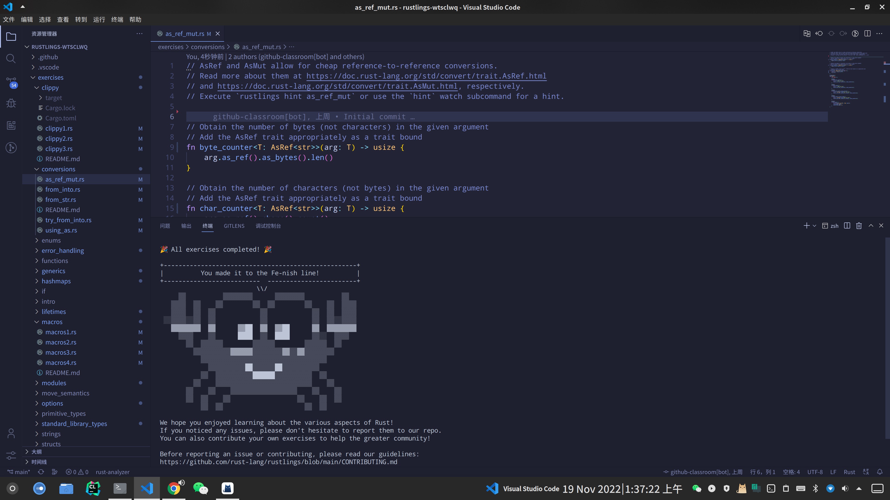

本文档内容为本人参加os2edu举办的**2022秋冬季开源操作系统训练营**的学习记录

---
## 2022.11.11 Day1
1. 开始阅读教材
2. 搭建rustlings的实验环境
3. 搭建学习记录repo

## 2022.11.12 Day2
### 上午 4小时
阅读教材并完成配套相关练习题
- 变量绑定与解构
- 数值类型
### 下午（晚上）1.5小时
喝酒去了，耽误一下午，晚上把基本类型这一节完成了
- 字符、布尔、单元类型
- 语句与表达式
- 函数
- 完成rustlings variables和functions部分的习题
## 2022.11.13 Day3
### 下午（晚上）3小时
阅读教材
- 所有权
- 引用和借用
## 2022.11.14 Day4
### 凌晨 2小时
- 重读教材关于所有权和引用的相关内容
- 寻找高质量博客并阅读
### 下午（晚上） 4小时
- 阅读TRPL关于所有权和引用的相关内容
- 学习教材并完成练习
    - 字符串与切片
## 2022.11.15 Day5
### 上午 1小时
阅读教材
- 元组
- 结构体
### 下午 2小时
阅读教材，完成习题
- 枚举
### 晚上 2小时
阅读教材，完成习题
- 数组
- 流程控制
## 2022.11.16 Day6
### 凌晨 2小时
阅读教材
- 模式匹配

### 上午 1.5小时
完成昨晚习题，阅读教材
- 方法 Method
### 下午（晚上） 8小时
阅读教材，完成习题
- 泛型
- 特征
- 特征对象
- 深入特征

## 2022.11.17 Day7
### 凌晨 2小时
完成rustlings习题
- structs
- move
- if
- vecs
- basic types
### 晚上 4小时
阅读教材，完成习题
- 集合类型
- 类型转换

## 2022.11.18 Day8
### 凌晨 2小时
阅读教材
- 返回值和错误处理
- 包和模块
- 注释和文档
- 格式化输出

---
终于看完教材的基础篇，接下来刷完rustlings,开始进入操作系统的学习并且二刷教材基础篇 
## 2022.11.19 凌晨
花了大半天，在视频课的帮助下完成了rustlings。
好难，高级特性完全不熟。

---
接下来可能不能日更了。

TODO：
- 二刷教材和基础课程
- 学习OS,XV6 Book
